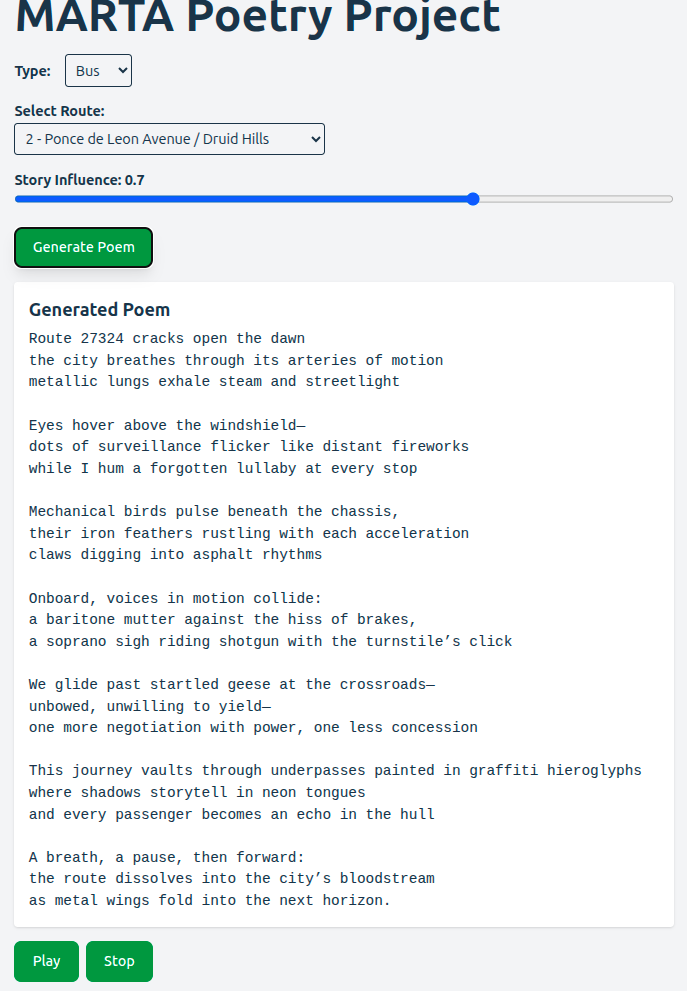

# MARTA-Poetry
The MARTA Poetry Project aims to generate poetry inspired by transit data from the Metro Atlanta Rapid Transit Authority, using route "personalities", narrative elements, and real-time inputs.

The goal is to create a system that interacts with a core canon of poems that serve as what is called The Homonculus. Each route will, based on its personality, either work with or against the narrative elements of The Homonculus.

## TODO
* Add core poems, potentially as a knowledge graph 

* Add speech and background sound/music

* The creator's voice will be present in this poetic ecosystem, so there will be means to add or remove narrative elements, tweak personalities or add additional constraints. Eventually human users will be able to comment on routes and even submit their own works. Works presented by humans will not be saved without their explicit consent   
