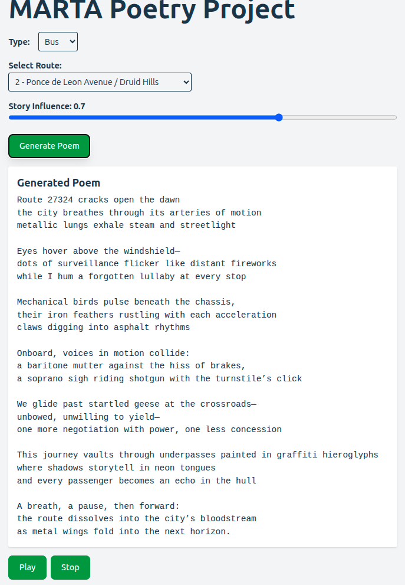

# MARTA-Poetry
The MARTA Poetry Project aims to generate poetry inspired by transit data from the Metro Atlanta Rapid Transit Authority, using route "personalities", narrative elements, and real-time inputs.

The goal is to create a system that interacts with a core canon of poems that serve as what is called The Homunculus. Each route will, based on its personality, either work with or against the narrative elements of The Homunculus.



## Installation and Setup

### Prerequisites

- Python 3.8+ 
- Node.js 18+ and npm
- Git

### Backend Setup

1. **Clone the repository:**
   ```bash
   git clone <your-repo-url>
   cd MARTA-Poetry
   ```

2. **Set up Python virtual environment:**
   ```bash
   cd backend
   python -m venv venv
   source venv/bin/activate  # On Windows: venv\Scripts\activate
   ```

3. **Install Python dependencies:**
   ```bash
   pip install -r requirements.txt
   ```

4. **Set up environment variables:**
   Create a `.env` file in the backend directory with the following entries:
   ```
   POETRY_MODE=[development or production]
   DEFAULT_STORY_INFLUENCE=0.7
   OPENAI_API_KEY=your_OPENAI_API_KEY_here
   AZURE_OPENAI_API_KEY=your_AZURE_OPENAI_API_KEY_here
   AZURE_OPENAI_ENDPOINT=your_AZURE_OPENAI_ENDPOINT_here
   AZURE_OPENAI_DEPLOYMENT_NAME=your_poem_generation_deployment
   AZURE_OPENAI_API_VERSION=2024-12-01-preview
   # Optional: separate deployment for title generation (recommended)
   AZURE_OPENAI_API_KEY_TITLES=your_AZURE_OPENAI_API_KEY_for_titles
   AZURE_OPENAI_ENDPOINT_TITLES=your_AZURE_OPENAI_ENDPOINT_for_titles
   AZURE_OPENAI_DEPLOYMENT_NAME_TITLES=gpt-4o
   AZURE_OPENAI_API_VERSION_TITLES=2024-12-01-preview
   ```

5. **Download GTFS data (required for automatic stop extraction):**
   ```bash
   chmod +x get_gtfs.sh
   ./get_gtfs.sh
   ```
   
   The GTFS data enables automatic extraction of real transit stops when creating new route personalities. Without it, routes will use placeholder stops.

### Frontend Setup

1. **Navigate to frontend directory:**
   ```bash
   cd ../frontend
   ```

2. **Install Node.js dependencies:**
   ```bash
   npm install
   ```

## Running the Application

### Start the Backend

1. **Navigate to backend directory:**
   ```bash
   cd backend
   ```

2. **Activate virtual environment (if not already active):**
   ```bash
   source venv/bin/activate  # On Windows: venv\Scripts\activate
   ```

3. **Start the FastAPI server:**
   ```bash
   uvicorn app:app --reload --host 0.0.0.0 --port 8000
   ```

   The backend API will be available at `http://localhost:8000`
   API documentation will be available at `http://localhost:8000/docs`

### Start the Frontend

1. **In a new terminal, navigate to frontend directory:**
   ```bash
   cd frontend
   ```

2. **Start the development server:**
   ```bash
   npm run dev
   ```

   The frontend will be available at `http://localhost:5173`

### Accessing the Application

Once both servers are running:
- Frontend: `http://localhost:5173`
- Backend API: `http://localhost:8000`
- API Docs: `http://localhost:8000/docs`

## Project Structure

```
MARTA-Poetry/
├── backend/           # FastAPI backend
│   ├── app.py        # Main FastAPI application
│   ├── poetry/       # Poetry generation modules
│   ├── data/         # GTFS data and character profiles
│   └── storage/      # Data storage utilities
├── frontend/         # React frontend
│   ├── src/          # Source code
│   └── public/       # Static assets
├── functions/        # Azure Functions
└── bicep/           # Azure infrastructure
```

## Key Features

### Poem Management
- **Generate Poems**: Create AI-generated poetry for MARTA routes based on personality and narrative
- **Audio Generation**: Convert poems to engaging audio narration with multiple voice options
- **Batch Operations**: Mark multiple poems as core, extensions, or delete them
- **Search and Filter**: Find poems by title, route, content, or narrative role

### Narrative Framework
- **Core Narrative**: Designate canonical poems that form the core narrative
- **Extensions**: Create narrative extensions that build on core poems
- **Relationships**: Track thematic connections between poems
- **Entity Tracking**: Manage themes, imagery, emotions, and sound devices

### Admin Interface
- Poetry Manager for viewing and organizing poems
- Audio controls for playback and regeneration
- Narrative status monitoring
- Batch delete functionality with audio cleanup

## Documentation

- [Audio Generation Feature](backend/AUDIO_FEATURE.md) - Text-to-speech implementation details
- [Poem Deletion Feature](DELETE_POEMS_QUICKSTART.md) - How to delete poems and audio files
- [Technical Details](DELETE_POEMS_FEATURE.md) - Architecture and API details

## TODO
* Add core poems, potentially as a knowledge graph 

* Add speech and background sound/music

* The creator's voice will be present in this poetic ecosystem, so there will be means to add or remove narrative elements, tweak personalities or add additional constraints. Eventually human users will be able to comment on routes and even submit their own works. Works presented by humans will not be saved without their explicit consent   
