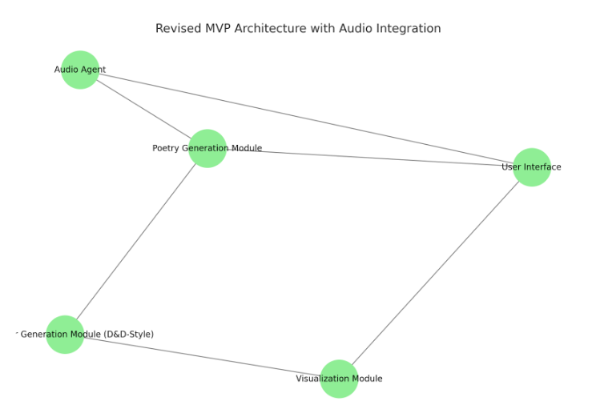
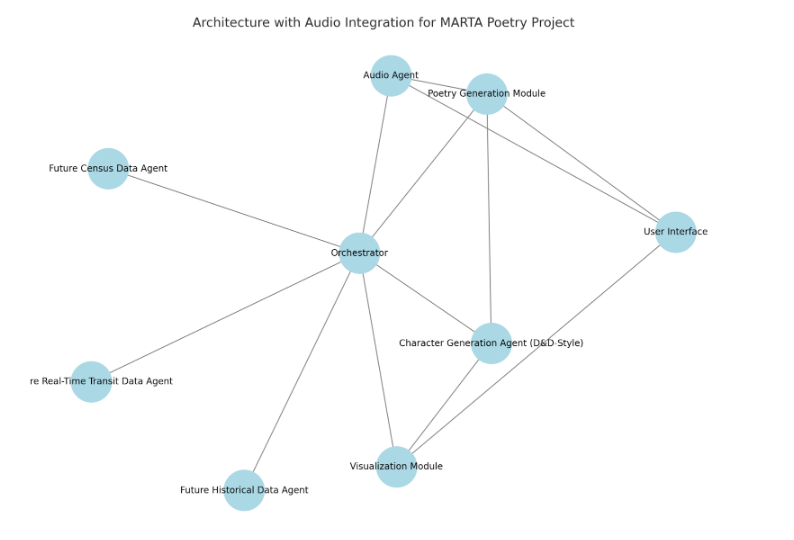

# MARTA Poetry Project - Design Document

## Introduction
The MARTA Poetry Project aims to generate poetry inspired by transit data from the MARTA system, using route personalities, narrative elements, and real-time inputs to craft unique and dynamic poetry. This document outlines the system design, including the Minimum Viable Product (MVP) and expanded architecture.

## Minimum Viable Product (MVP)
The MVP focuses on core functionality, enabling poetry generation based on D&D-style character generation for routes. It includes route selection, personality-based poetry, and a responsive user interface.

### MVP Architecture Diagram

## Expanded Architecture
The expanded architecture includes additional features such as narrative integration, real-time data processing, audio and visualization enhancements, and user customization. This design builds on the MVP to create a comprehensive poetry generation platform.

### Expanded Architecture Diagram

## Key Components

### Character Generation Agent
Responsible for defining personalities of routes using D&D-style traits or templates. This agent supports route-specific, group-level, and system-wide modifications.

### Narrative Integration
Incorporates central story elements to guide the poetry, enabling routes to 'riff' off a shared narrative while maintaining individual creativity.

### Poetry Generator
Creates poetry based on input from the Character Generation Agent and narrative elements. Supports template-based generation, real-time adaptation, and user editing.

### Visualization and Audio
Includes tools for displaying route-based visuals and integrating audio elements such as spoken poetry, background music, and sound effects.

### User Interface
Provides responsive interfaces for regular users and administrators, enabling customization and interaction with generated poetry, visuals, and audio.

---

## Deployment Strategy

### Azure Infrastructure
- **Web App**: Hosted on Azure App Service.
- **AI Model**: Uses Azure OpenAI Service (GPT-4 or GPT-3.5).
- **Database**: Azure Cosmos DB or Table Storage.
- **File Storage**: Azure Blob Storage for GTFS and poetry storage.
- **Real-Time Processing**: Azure Functions for GTFS updates.
- **Speech Integration**: Azure Speech Service for text-to-speech conversion.
- **Monitoring & Security**: Azure Monitor and Application Insights.

### CI/CD Pipeline (Azure DevOps)
- **Stage 1: Infrastructure Deployment**
  - Deploys Azure components via Bicep templates.
- **Stage 2: Flask App Deployment**
  - Deploys the web app to Azure App Service.
- **Stage 3: Function Deployment**
  - Deploys Azure Functions for GTFS real-time updates.

## Next Steps
1. Finalize UI and route modification features.
2. Optimize cost by caching AI responses and reducing API calls.
3. Implement advanced storytelling mechanisms.
