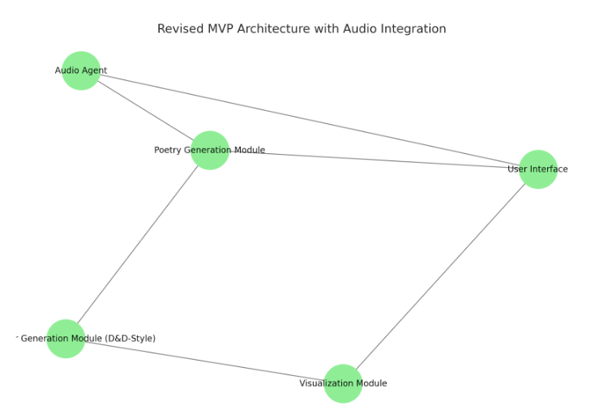
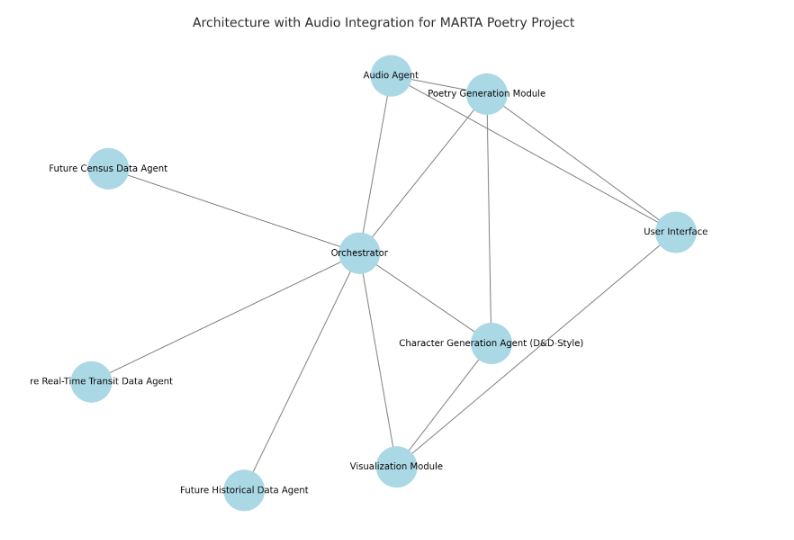

# MARTA Poetry Project - Design Document

## Introduction
The MARTA Poetry Project aims to generate poetry inspired by transit data from the MARTA system, using route personalities, narrative elements, and real-time inputs to craft unique and dynamic poetry. This document outlines the system design, including the Minimum Viable Product (MVP) and expanded architecture.

## Minimum Viable Product (MVP)
The MVP focuses on core functionality, enabling poetry generation based on D&D-style character generation for routes. It includes route selection, personality-based poetry, and a responsive user interface.

### MVP Architecture Diagram

## Expanded Architecture
The expanded architecture includes additional features such as narrative integration, real-time data processing, audio and visualization enhancements, and user customization. This design builds on the MVP to create a comprehensive poetry generation platform.

### Expanded Architecture Diagram

## Key Components

### Character Generation Agent
Defines personalities of routes using character archetypes and attributes. Each route has:
- **Loyalty to Canon**: Degree of adherence to narrative constraints (0-1 scale)
- **Rebellious Mode**: How the route deviates from standard narrative patterns
- **Personality Description**: Custom traits and behavioral characteristics

The agent generates unique poetic voices for each route while respecting or subverting shared narrative elements.

### Route Agent
Manages route-specific characteristics and poetry generation. Incorporates:
- Route metadata (GTFS data: stops, schedule, geography)
- Automatic GTFS stop extraction: When creating new routes, the system automatically extracts the 5 most frequently-served stops from GTFS data
- Contextual parameters (time of day, location, passenger count, story influence)
- Route personality traits and generation modes
- Support for both route short names (e.g., "39") and GTFS IDs (e.g., "27345")

### Narrative Engine
Provides central story constraints and shared narrative elements that guide poetry generation:
- Central narrative framework with multiple story threads
- Route-level narrative adherence scoring
- Dynamic story influence parameter (0-1 scale) to control narrative adherence
- Support for "riffing off" shared narrative while maintaining individual route voice

### Poetry Generator
Creates poetry based on multi-agent coordination:
- Combines character traits, route metadata, and narrative constraints
- Uses Claude AI for high-quality, contextual poetry generation
- Supports multiple generation modes through prompt templating
- Integrates sound devices (alliteration, assonance, repetition, onomatopoeia)
- Applies thematic and imagery-based generation strategies

### Extended Poetry Graph
Knowledge graph representing:
- All generated poems with metadata (themes, imagery, emotions, sound devices)
- Character and route relationships
- Narrative connections and dependencies
- Used for consistency checking and narrative adherence validation

### User Interface
Responsive web interface built with React/Vite:
- Poetry browser and explorer
- Route visualization
- Real-time poetry generation with customizable parameters
- Admin interface for managing core poems and route personalities

---

## Deployment Strategy

### Current Architecture
The project uses a Python-based backend with Flask/FastAPI serving a React frontend:

**Backend (Python)**
- FastAPI application for REST API endpoints
- Poetry generation pipeline using Claude AI
- Multi-agent orchestration (Character Agent, Route Agent, Narrative Engine)
- Graph database for poem relationships and metadata
- GTFS data integration for transit information

**Frontend (React/Vite)**
- Interactive poetry browser
- Route visualization and exploration
- Real-time poetry generation interface with parameter controls
- Responsive design for desktop and mobile

**Data Storage**
- JSON-based graph database for poems and relationships
- GTFS data files for transit information
- Configuration files for route personalities and character profiles

### Azure Infrastructure (Planned)
- **Web App**: Hosted on Azure App Service.
- **AI Model**: Uses Azure OpenAI Service (GPT-4 or GPT-3.5).
- **Database**: Azure Cosmos DB or Table Storage for scaled deployment.
- **File Storage**: Azure Blob Storage for GTFS and poetry storage.
- **Real-Time Processing**: Azure Functions for GTFS updates.
- **Speech Integration**: Azure Speech Service for text-to-speech conversion.
- **Monitoring & Security**: Azure Monitor and Application Insights.

### CI/CD Pipeline (Azure DevOps)
- **Stage 1: Infrastructure Deployment**
  - Deploys Azure components via Bicep templates.
- **Stage 2: Backend API Deployment**
  - Deploys the FastAPI app to Azure App Service.
- **Stage 3: Frontend Deployment**
  - Deploys React/Vite frontend to Azure Static Web Apps.
- **Stage 4: Function Deployment**
  - Deploys Azure Functions for background tasks and GTFS updates.

## Next Steps
1. Expand narrative constraints and story threads for richer poetry generation.
2. Implement audio generation (text-to-speech) for spoken poetry.
3. Optimize AI API costs through response caching and batch processing.
4. Deploy to Azure with containerization (Docker).
5. Add user authentication and poem favorites/collections.
6. Implement real-time GTFS updates to trigger new poetry generation.
7. Create admin dashboard for narrative management and route personality tuning.
